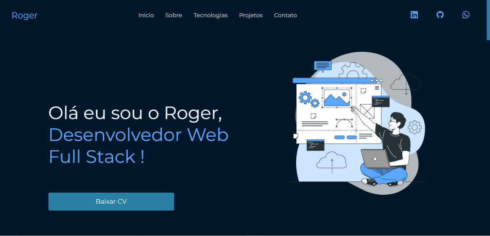

<h1 align="center">💻Meu Portfólio </h1>

 

  

<a  href="https://portfolio-pv3asns8s-rogervalentim.vercel.app/">Acesse o projeto clicando aqui</a>

<h1>🎨 Figma</h1>
<a href="https://www.figma.com/file/82BM3XesUT9iHNjYkkBWww/Untitled?node-id=0%3A1&t=ei9ZrF6iZxclkyrU-1">Clique aqui para ver o design no figma</h1>

<h1>💼 Tecnologias</h1>

Esse projeto foi desenvolvido com as seguintes tecnologias:

- HTML e CSS
- React
- React Hooks Form
- Swiper
- [Node e NPM](https://nodejs.org/)

