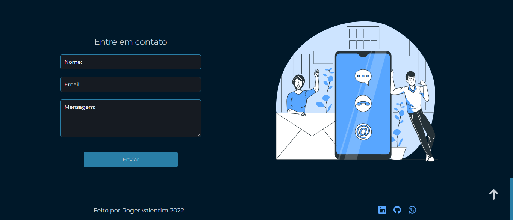

<h1 align="center"> Meu Portfólio </h1>

Meu primeiro portfólio na área de programação

  <a href="#-tecnologias">Tecnologias</a>&nbsp;&nbsp;&nbsp;|&nbsp;&nbsp;&nbsp;
  <a href="#-projeto">Projeto</a>&nbsp;&nbsp;&nbsp;|&nbsp;&nbsp;&nbsp;
  <a href="#-layout">Layout</a>&nbsp;&nbsp;&nbsp;|&nbsp;&nbsp;&nbsp;

 

<h1 align="center">Inicio</h1>

  

<h1 align="center">Sobre Mim</h1>

  

<h1 align="center">Tecnologias</h1>

  

<h1 align="center">Projetos</h1>

  

<h1 align="center">Contato</h1>

  

## 🚀 Tecnologias

Esse projeto foi desenvolvido com as seguintes tecnologias:

- HTML e CSS
- React
- [Node e NPM](https://nodejs.org/)

## 💻 Projeto

Esse é o meu primeiro portfólio de programação

---

